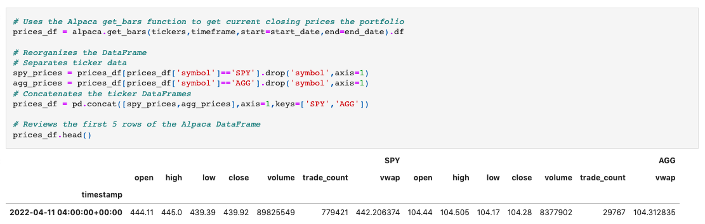

# Financial_Planning_Analysis
A tool to help a user analyze their emergency fund status as well as to help project their future investment performance for retirement.


---

## Technologies

This application is written in Python v. 3.9.7 and uses [JupyterLab](https://jupyter.org/) to deploy the code. This application makes use of
 the following libraries:


[pandas](https://pandas.pydata.org/docs/) was used for data collection, preparation, and analysis.

[matplotlib](https://matplotlib.org/stable/index.html) was used to plot data

[os](https://docs.python.org/3/library/os.html) was used to assist in the retrieval of my API key for Alpaca

[requests](https://docs.python-requests.org/en/latest/) was used to assist in API calls

[json](https://docs.python.org/3/library/json.html) was used to parse data retrieved from API calls into readable format for python

[dotenv](https://pypi.org/project/python-dotenv/) was used to call upon the .env file to retrieve API keys

[alpaca_trade_api](https://pypi.org/project/alpaca-trade-api/) was used to create alpaca REST objects


---

## Installation Guide

Prior to running this application, perform the following in the command line to install the required libraries:

`pip install pandas`

`pip install matplotlib`

`pip install jupyterlab`

`pip install os`

`pip install requests`

`pip install json`

`pip install dotenv`

`pip install alpaca_trade_api`

---

## Usage

In order to launch the application, navigate to the Financial_Planning_Analysis folder that contains all of the code for this application, and then type into the command line:

```
jupyter lab
```

Once in jupyter lab, open the financial_planning_tools.ipynb and run each cell in the jupyter file to see the resulting anlysis.

Below is an example of a cell's input code and the resulting output of the cell:



---

## Contributors

Robby Odum, Email: rodum012@gmail.com

---

## License

MIT